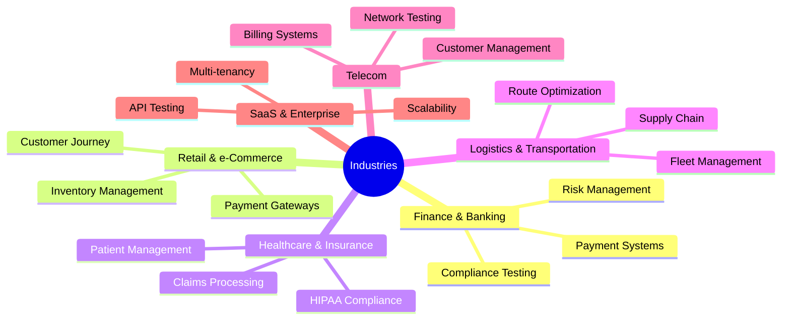

# Hi there, I'm Kasi Maddula! 👋

<div align="center">
  


[](https://www.linkedin.com/in/kasimaddula/)
[](mailto:kasi.maddula@gmail.com)
[](tel:+61452561347)


</div>

## 🚀 Profile Summary

```yaml
role: Senior Test Automation Architect & Quality Engineering Leader
experience: 18+ years
location: Melbourne, Australia
specialization: End-to-end testing services spanning entire SDLC & STLC
mission: Delivering scalable, robust, and high-performance automation solutions
```

A dynamic and results-driven **Test Automation Architect** with expertise in crafting automation strategies that align with business goals. I specialize in designing **intelligent, efficient, and maintainable regression suites** with **minimal turnaround times**, delivering **hyper-care post-production support**, and seamless CI/CD integration.

## 🎯 Core Expertise

<div align="center">

### 🔄 Full SDLC/STLC Coverage


### 🏗️ Framework Architecture


### ⚡ Automation Excellence


</div>

## 🛠️ Tech Stack

<div align="center">

### Programming Languages


### Automation Tools


### CI/CD & DevOps


### Test Management & Monitoring


</div>

## 📊 GitHub Stats

<div align="center">
  


</div>

## 🏆 Key Achievements

<div align="center">

| Achievement | Impact | Timeline |
|-------------|--------|----------|
| ⚡ **Regression Suite Optimization** | Reduced execution time from 14 hours to 2.5 hours | Delivered |
| 🚀 **Daily Release Pipeline** | Zero defect leakage over 12 months | Sustained |
| 🛡️ **Shift-Left Implementation** | 40% reduction in post-UAT defects | 6 months |
| 👨‍🏫 **Team Mentorship** | Trained 50+ QA engineers across 5 organizations | Ongoing |

</div>

## 🌐 Industry Expertise



## 🎯 Service Offerings

<details>
<summary><b>🔧 Test Automation Strategy & Implementation</b></summary>

- Framework design and architecture
- CI/CD pipeline integration
- Automated regression suites
- Cross-browser and cross-platform testing
- API and database testing automation

</details>

<details>
<summary><b>📊 Quality Engineering Consulting</b></summary>

- Test strategy and planning
- QA process optimization
- Team capability assessment
- Quality metrics and KPIs setup
- Risk-based testing approaches

</details>

<details>
<summary><b>🚀 Post-Production Support</b></summary>

- Hyper-care monitoring
- Production issue analysis
- Hotfix validation
- Synthetic monitoring setup
- Performance monitoring

</details>

<details>
<summary><b>👨‍🏫 Training & Mentorship</b></summary>

- Test automation best practices
- Framework development training
- CI/CD integration workshops
- Quality culture transformation
- Individual and team coaching

</details>

## 📈 Best Practices I Champion

<div align="center">


</div>

## 🤝 Let's Connect & Collaborate

<div align="center">

### Ready to elevate your quality engineering practices?

**I bring end-to-end quality ownership with quick turnaround and tangible results.**

[](mailto:kasi.maddula@gmail.com)
[](https://www.linkedin.com/in/kasimaddula/)
[](mailto:kasi.maddula@gmail.com)

### 📞 **Direct Contact:** +61-452-561-347

</div>

## 💡 Current Focus

- 🔬 Exploring AI-powered test automation frameworks
- 🌟 Implementing shift-left and shift-right quality practices
- 🎯 Building next-generation testing solutions
- 📚 Continuous learning and knowledge sharing

---

<div align="center">

### "Quality is not an act, it is a habit." - Aristotle


**Thanks for visiting! Let's build quality into every line of code! 🚀**

</div>
